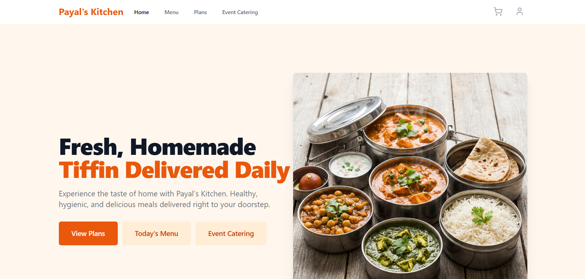
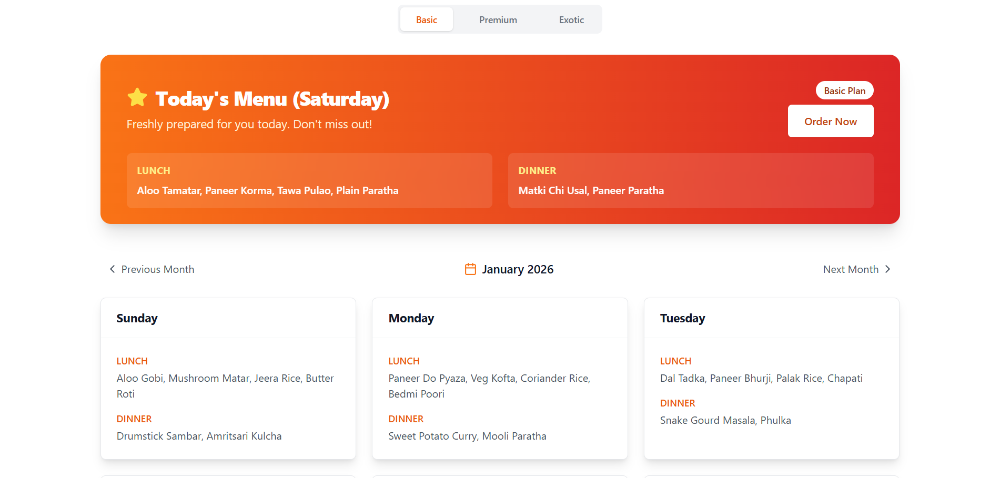

# 🍴 Payal's Kitchen - Advanced Food Order Management System

[](https://reactjs.org/)
[](https://nodejs.org/)
[](https://www.mongodb.com/)
[](https://opensource.org/licenses/ISC)
[](https://tailwindcss.com/)

**Payal's Kitchen** is a premium, full-stack MERN application designed for seamless food subscription management, event catering, and order tracking. Built with modern aesthetics and a robust architecture, it serves three primary user roles: Customers, Employees, and Administrators.

---

## 📸 Guided Tour

### Home Experience

*A vibrant landing page featuring meal plans and service highlights.*

### Interactive Menu

*Daily meal discovery with plan-based filtering and dietary preferences.*

---

## ✨ Key Features

### 👤 Customer Experience
- **Subscription Engine**: 
  - Choice of **Basic**, **Premium**, or **Exotic** tiers.
  - Flexible Monthly/Yearly billing.
  - Smart upgrade system with pro-rated pricing logic.
- **Dynamic Daily Menus**: Real-time menu updates for Lunch & Dinner.
- **Advanced Ordering**: 
  - Single-item custom orders.
  - Event catering with bulk quantities.
  - Scheduled delivery (minimum 2 days notice).
- **Financial Integration**: 
  - Secure Razorpay payment gateway.
  - Intelligent coupon system for discounts.
- **Support Hub**: Integrated complaint and feedback system with real-time status tracking.


### 🛡️ Admin Suite
- **Pulse Dashboard**: 
  - KPI tracking (Total Revenue, Active Users, Pending Orders).
  - Visual data representation using Recharts.
- **User Governance**: Full control over user accounts and permission roles.
- **Kitchen Management**: 
  - Manage meal plans and complex daily menus.
  - Configure event catering inventory.
- **Marketing Tools**: Comprehensive coupon creation and usage analytics.
- **Complaint Desk**: Priority-based resolution center for customer feedback.

---

## 🏗️ Technology Stack

| Layer | Technology |
| :--- | :--- |
| **Frontend** | React 19, Vite, React Router 7, Tailwind CSS, Lucide Icons, Recharts |
| **Backend** | Node.js, Express.js (v5), JWT Authentication, Bcrypt.js |
| **Database** | MongoDB with Mongoose |
| **Payment** | Razorpay Node SDK |
| **Dev Tools** | ESLint, PostCSS, Nodemon |

---

## 🚀 Quick Start

### Prerequisites
- Node.js (v18+)
- MongoDB (Local or Atlas)
- Razorpay API Keys

### 1. Installation
```bash
git clone <your-repo-url>
cd food-order-management-system
```

### 2. Environment Configuration

#### Server (`/server/.env`)
```env
PORT=5000
MONGO_URI=your_mongodb_connection_string
JWT_SECRET=your_jwt_secret_key
RAZORPAY_KEY_ID=your_razorpay_key_id
RAZORPAY_KEY_SECRET=your_razorpay_key_secret
NODE_ENV=development
```

#### Client (`/client/.env`)
```env
VITE_RAZORPAY_KEY_ID=your_razorpay_key_id
```

### 3. Database Initialization
```bash
cd server
npm install
node importData.js 
npm run dev
```

### 4. Client Launch
```bash
cd client
npm install
npm run dev
```

---

## 📂 Project Architecture

```text
├── client/                 # Frontend (React + Vite)
│   ├── src/
│   │   ├── components/    # Atomic UI components
│   │   ├── context/       # Auth & Cart State
│   │   ├── hooks/        # Custom logic (Razorpay, etc.)
│   │   └── pages/         # Dashboard & Public Routes
│
├── server/                # Backend (Express.js)
│   ├── controllers/      # Business logic
│   ├── models/           # Mongoose schemas
│   ├── routes/           # API endpoints
│   └── utils/            # Helper functions (Subscription logic)
```

---

## 💳 Payment Flow
Payal's Kitchen implements a secure **Razorpay Integration**:
1. Order initialization on the server.
2. Secure checkout signature verification.
3. Automated subscription activation upon successful transaction.
4. Support for test mode using Razorpay's sandbox.

---

## 🤝 Contributing
Contributions are what make the open source community such an amazing place to learn, inspire, and create.
1. Fork the Project.
2. Create your Feature Branch (`git checkout -b feature/AmazingFeature`).
3. Commit your Changes (`git commit -m 'Add some AmazingFeature'`).
4. Push to the Branch (`git push origin feature/AmazingFeature`).
5. Open a Pull Request.

---

## 📜 License
State-of-the-art software distributed under the **ISC License**.

---

Developed with ❤️ by the **Payal's Kitchen** Team.
